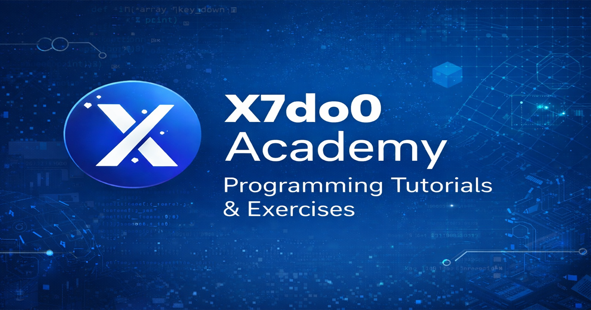

# أكاديمية X7do0

منصة عربية لتعلّم البرمجة بالتطبيق، تجمع الشرح المختصر والأمثلة والتمارين العملية والمشاريع ضمن تجربة واحدة واضحة.

[زيارة الأكاديمية](https://x7do0.github.io/X7do0-Academy/) · [دورة بايثون](https://x7do0.github.io/X7do0-Academy/courses/python/index.html) · [التمارين](https://x7do0.github.io/X7do0-Academy/courses/python/practice/index.html) · [المشاريع](https://x7do0.github.io/X7do0-Academy/courses/python/project/index.html)

## المحتوى المتاح

### أساسيات بايثون

تضم الدورة 12 موضوعاً برمجياً مرتبة من الطباعة والمتغيرات إلى القوائم والقواميس والمجموعات. كل موضوع يحتوي أمثلة مباشرة وملفين يمكن عرضهما داخل الصفحة:

- ملف الموضوع لمراجعة الأمثلة الأساسية.
- ملف التحدي للتطبيق بعد فهم الفكرة.

تبقى أكواد بايثون والمصطلحات الضرورية بصيغتها الإنجليزية الصحيحة، بينما تكون الواجهة والشرح بالعربية.

### التمارين

تضم الدورة 25 سؤالاً وتحدياً موزعة حسب الموضوع. يظهر نص المطلوب بالعربية والإنجليزية، ثم خطوات الحل ومساحة كتابة الكود والحل المرجعي. يقبل التحقق طرق الحل المختلفة عندما تنتج السلوك الصحيح، ويحفظ تقدّم التمارين محلياً على جهاز المستخدم.

### المشاريع

تعرض صفحة المشاريع مشروع مدير مهام مبنياً على ست مراحل مترابطة. تشرح كل مرحلة الهدف والخطوات والنتيجة المتوقعة لتوضيح طريقة تحويل الفكرة إلى مشروع منظم.

## طريقة الاستفادة

1. ابدأ من كاردات المواضيع البرمجية في صفحة دورة بايثون.
2. افتح ملف الموضوع داخل الصفحة وراجع الأمثلة.
3. انتقل إلى ملف التحدي وجرّب تطبيق الفكرة.
4. استخدم التمارين لقياس فهمك وكتابة حلول مختلفة.
5. راجع مراحل المشروع الختامي لترى كيف تجتمع المفاهيم داخل منتج واحد.

## تجربة القراءة

- واجهة عربية كاملة واتجاه RTL.
- أكواد ومخرجات باتجاه LTR ثابت على الهاتف وسطح المكتب.
- مظهر فاتح وداكن.
- تنقل سريع بين الدروس والتمارين والمشاريع.
- حفظ تقدّم التمارين محلياً من دون حساب مستخدم.

## الرخصة

المحتوى والمشروع متاحان وفق [رخصة MIT](LICENSE).
