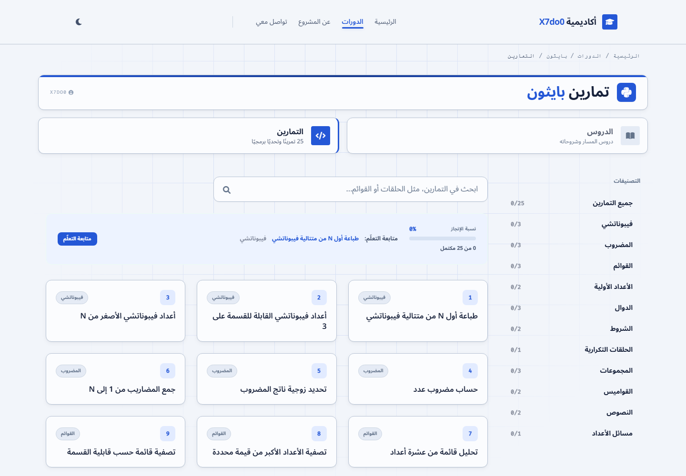
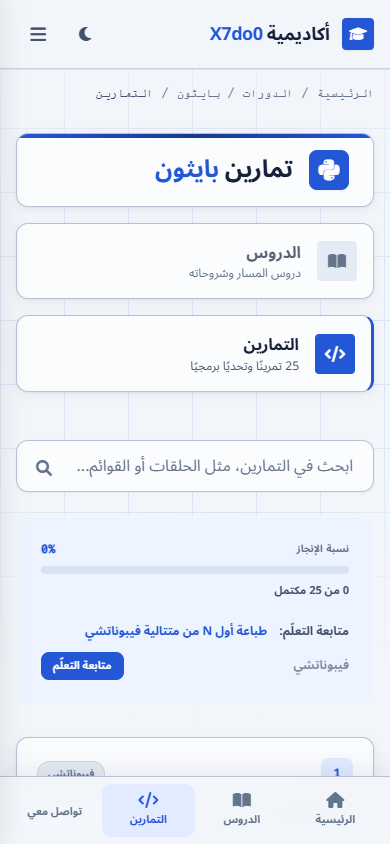

# أكاديمية X7do0


منصة تعليمية عربية مفتوحة لتعلّم البرمجة بالتطبيق. يبدأ المتعلم من شرح موجز، يجرّب الكود داخل المتصفح، يحصل على تحقق تلقائي للنتيجة، ثم يطبّق ما تعلمه في مشروع ختامي متدرج.

[تجربة الموقع](https://x7do0.github.io/X7do0-Academy/) · [عن المشروع](https://x7do0.github.io/X7do0-Academy/about/index.html) · [التمارين](https://x7do0.github.io/X7do0-Academy/courses/python/practice/index.html) · [المشروع الختامي](https://x7do0.github.io/X7do0-Academy/courses/python/project/index.html)

## المشكلة والحل

كثير من محتوى البرمجة يفترض معرفة سابقة باللغة الإنجليزية أو تجربة مريحة على الكمبيوتر فقط. أكاديمية X7do0 تجعل الشرح والتنقل بالعربية، وتحافظ في الوقت نفسه على صياغة الكود الإنجليزية الصحيحة واتجاهه من اليسار إلى اليمين. الواجهة مصممة للهاتف أولاً وتدعم RTL في كل الصفحات.

## المزايا الحالية

- 12 درساً منظماً في أساسيات Python مع أمثلة وملفات قابلة للتنزيل.
- 25 تمريناً عملياً، والسؤال معروض بالعربية والإنجليزية.
- مساحة عمل تشغّل Python داخل المتصفح وتتحقق من السلوك والمخرجات.
- قبول طرق الحل المختلفة عندما تنتج السلوك الصحيح، مع حالات: مطابق، قريب، أو غير مطابق.
- إكمال تلقائي للسؤال بعد الحل الصحيح، وحفظ التقدم محلياً.
- مشروع ختامي لبناء مدير مهام عبر ست مراحل قابلة للتشغيل.
- مظهر فاتح وداكن، وتنقل متجاوب للهاتف والكمبيوتر.
- مشاركة عربية للدروس والأسئلة عبر تيليغرام وواتساب.
- Metadata وOpen Graph وCanonical وملفا `sitemap.xml` و`robots.txt`.

## لقطات

| سطح المكتب | الهاتف |
| --- | --- |
|  |  |

## التقنيات

- HTML ثابت وCSS وJavaScript بوحدات ES Modules.
- Tailwind CSS أثناء البناء، مع نظام تصميم ومتغيرات CSS خاصة بالمشروع.
- Pyodide لتشغيل Python داخل المتصفح عند أول طلب.
- Node.js لبناء الصفحات من المصادر والقوالب والتحقق من الروابط.
- GitHub Pages للنشر.

لا توجد حالياً حسابات مستخدمين أو Backend أو قاعدة بيانات، ولا يرسل الموقع كود المتعلم إلى خادم تابع للمشروع.

## بنية المستودع

```text
assets/          الأنماط والسكربتات والصور وملف الترجمة
courses/         صفحات الدروس والتمارين والمشروع المولّدة
data/            بيانات الدروس والأسئلة وقواعد التحقق
docs/            صور التوثيق
files/           ملفات Python القابلة للتنزيل
src/pages/       مصادر محتوى الصفحات
src/templates/   القوالب المشتركة
tools/           أداة البناء والتحقق
```

الملفات في الجذر وداخل `accounts/` و`about/` و`courses/` هي ناتج البناء الجاهز للنشر. لا تعدّلها وحدها؛ عدّل المصدر المقابل ثم أعد البناء.

## التشغيل محلياً

المتطلبات:

- Git.
- Node.js 18 أو أحدث مع npm.
- Python اختياري فقط لتشغيل خادم محلي بسيط في الأمر أدناه.

```bash
git clone https://github.com/x7do0/X7do0-Academy.git
cd X7do0-Academy
npm ci
npm run build
python -m http.server 4173
```

بعدها افتح `http://localhost:4173`. لا يُنصح بفتح `index.html` مباشرة بصيغة `file://` لأن ملفات البيانات والنصوص تُحمّل عبر المتصفح.

أثناء تعديل CSS:

```bash
npm run dev
```

## البناء

```bash
npm run build
```

ينفذ الأمر ثلاث خطوات:

1. يبني ملف Tailwind CSS المصغّر.
2. يولّد الصفحات الثابتة و`robots.txt` و`sitemap.xml`.
3. يتحقق من الصفحات والروابط والملفات المطلوبة وCanonical.

أمر التحقق وحده:

```bash
npm run check
```

## قرارات التصميم

- العربية هي لغة الواجهة الوحيدة، بينما يبقى الكود والمصطلح الضروري بالصياغة الأصلية.
- اتجاه الصفحة RTL، وتُعزل مناطق الكود والمخرجات دائماً باتجاه LTR.
- روابط الأسئلة والدروس ثابتة وقابلة للمشاركة.
- التقدم محفوظ في `localStorage` على جهاز المستخدم؛ لا ينتقل بين الأجهزة.
- المحرك يُحمّل عند أول تشغيل لتقليل كلفة التحميل الأولي.

## الحدود الحالية

- مسار Python هو المسار التعليمي المتاح حالياً.
- لا توجد مزامنة سحابية أو تسجيل دخول.
- التحقق العملي يعمل داخل المتصفح وقد يكون تشغيله الأول أبطأ بسبب تنزيل Pyodide.
- LinkedIn والبريد المهني لم يُضافا بعد لأن بياناتهما لم تُحدّد.

## خارطة الطريق

- إضافة مسارات وتمارين برمجية جديدة.
- توسيع المشروع الختامي وإضافة مشاريع تطبيقية أخرى.
- تحسين تحليل أخطاء المتعلم والتغذية الراجعة.
- إضافة اختبارات واجهة آلية عندما يستقر نطاق الصفحات.
- إضافة بيانات التواصل المهني عند اعتمادها.

## ملخص إنجليزي

X7do0 Academy is an Arabic-first, mobile-first static learning platform for practical programming education. It currently provides Python lessons, browser-based exercises with behavior-oriented validation, local progress tracking, and a six-stage final project.

## الرخصة

هذا المشروع متاح وفق [رخصة MIT](LICENSE).
